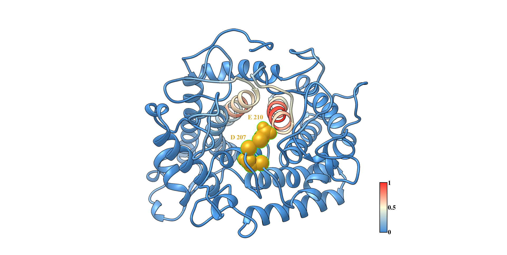
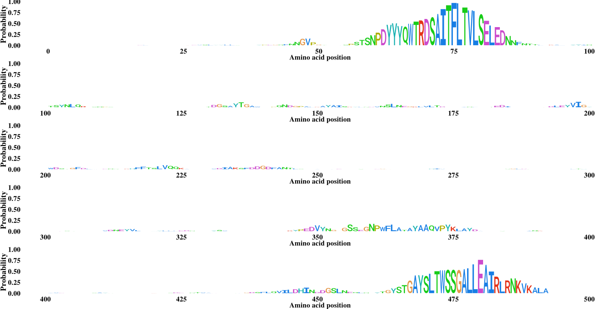

# MECE
#### a method for enhancing the catalytic efficiency of glycoside hydrolase based on deep neural networks and molecular evolution

---
A lack of effective prediction tools has limited development of high efficiency glycoside hydrolases (GH), which are in high demand for numerous industrial applications. This proof-of-concept study demonstrates the use of a deep neural network and molecular evolution (MECE) platform for predicting catalysis-enhancing mutations in GHs. The MECE platform integrates a deep learning model (DeepGH), trained with 119 GH family protein sequences from the CAZy database. MECE also includes a quantitative mutation design component that uses Gradient-weighted Class Activation Mapping (Grad-CAM) with homologous protein sequences to identify key features for mutation in the target GH, this component can be used in this page.

---

### Requirements:
- python 2 or python 3
- tensorflow == 1.15.0
- keras == 2.3.1
- numpy == 1.19.0
- opencv-python == 3.3.1
- matplotlib == 2.3.5
- scikit-learn == 0.19.2

### USE MECE 
#### You can use MECE online or download all of the codes to run MECE in local.
- Online version:    
[PirD MECE](http://www.elabcaas.cn/pird/mece) 

- Use in local:  
  Uhe code MECE.py by the following script in console, the ten-fold models are saved in [./models](./models)
`python MECE.py -data_url <fasta file dir> -data_url <outpot folder dir> `

- Visualization:  
When you finish run the <mece.py> or get zip file from [PirD MECE](http://www.elabcaas.cn/pird/mece), a csv file will be generated, and also plot the weight in the same dir. 
You can use [plot_logo.r](./plot_logo.r) to plot motif figure or you can use <Chimera - define attribute> to plot 2D structure with weight. 
An example result file for plot motif and 2D sturcture have been saved in [example](./example), the function for generate these files also in [MECE.py](mece.py) 
For plot 2d structure, you must download [UCSF Chimera](https://www.cgl.ucsf.edu/chimera/) or [UCSF Chimera](https://www.cgl.ucsf.edu/chimerax/). 

- EXAMPLE: 

### Train your own Deep-GH
If you want to train your own model, you can use [keras_RNN_train_gpu.py](./train_models/keras_RNN_train_gpu.py) in [train_models](./train_models)
Our dataset are saved in [data](./data)
